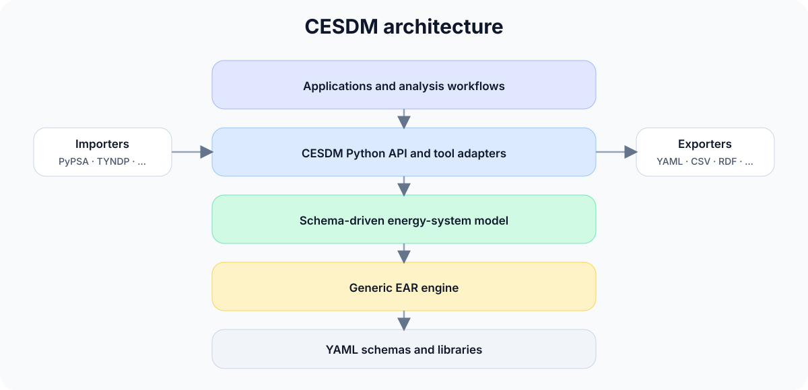

<p align="center">
  
</p>

<p align="center">
  <a href="https://cesdm.github.io/cesdm-toolbox/"></a>
  <a href="LICENSE"></a>
  
</p>

<p align="center">
  <strong>A schema-driven, tool-independent semantic framework for interoperable energy-system modelling.</strong>
</p>

<p align="center">
  Build once · Validate once · Exchange everywhere
</p>

---

## Why CESDM?

Energy-system studies often combine several specialised tools, each with its own data structures, terminology, and assumptions. Moving models between them usually requires custom conversion logic and repeated interpretation of the same physical system.

**CESDM provides a common semantic representation between data sources, modelling tools, and analysis workflows.**

| Principle | What it means |
|---|---|
| **Tool independent** | Describe the system independently of a particular solver or simulation package. |
| **Schema driven** | Define entity classes, attributes, relations, and validation rules in YAML. |
| **Interoperable** | Import, validate, transform, and exchange models across different tools and formats. |
| **Extensible** | Add domain-specific entities and relations without rewriting the generic EAR engine. |

<p align="center">
  
</p>

---

## Core idea

CESDM applies the generic **Entity–Attribute–Relation (EAR)** paradigm to energy systems.

- An **entity** is an object, such as a generation unit, electrical bus, demand unit, or transmission line.
- An **attribute** is a property of an entity, such as `nominal_voltage` or `nominal_power_capacity`.
- A **relation** connects entities, such as `atNode`, `fromNode`, or `hasTechnology`.

Energy-specific semantics are defined in YAML schemas; the EAR engine itself remains domain independent.

<p align="center">
  
</p>

---

## Architecture

CESDM separates generic data modelling from energy-specific semantics and tool-specific adapters.

<p align="center">
  
</p>

---

## Installation

```bash
git clone https://github.com/cesdm/cesdm-toolbox.git
cd cesdm-toolbox

python -m venv .sweet-cosi-cesdm
source .sweet-cosi-cesdm/bin/activate
# Windows: .sweet-cosi-cesdm\Scripts\activate

python -m pip install --upgrade pip setuptools wheel
pip install -e .
```

<details>
<summary>Using <a href="https://docs.astral.sh/uv/">uv</a> or Poetry instead</summary>

```bash
# uv
uv venv
source .venv/bin/activate   # Windows: .venv\Scripts\activate
uv pip install -e .

# Poetry
poetry install
poetry shell
```

</details>

Optional components:

| Component | Command |
|---|---|
| PyPSA | `pip install -e ".[pypsa]"` |
| pandapower | `pip install -e ".[pandapower]"` |
| MATPOWER | `pip install -e ".[matpower]"` |
| Development tools | `pip install -e ".[dev]"` |
| Everything | `pip install -e ".[all]"` |

---

## 60-second quick start

```python
from cesdm_toolbox import build_model_from_yaml

model = build_model_from_yaml(schema_path="schemas/cesdm")
model.import_library(library_yaml="library/default_library")

model.add_entity(
    entity_class="EnergySystemModel",
    entity_id="ch_example",
)

bus = model.add_entity(
    entity_class="ElectricalBus",
    entity_id="bus.ch.1",
)

bus.add_attribute(
    attribute_id="nominal_voltage",
    value=380,
    unit="kV",
)

generator = model.add_entity(
    entity_class="GenerationUnit",
    entity_id="gas.ch.1",
)

generator.add_attribute(
    attribute_id="nominal_power_capacity",
    value=400,
    unit="MW",
)

generator.add_relation(
    relation_id="atNode",
    target_entity_id="bus.ch.1",
)

generator.add_relation(
    relation_id="hasTechnology",
    target_entity_id="Generation.Thermal.Gas.CCGT.Present2",
)

model.validate_or_raise()

print(model.summary())

print(
    generator.get_attr_value(
        "nominal_power_capacity",
        default=0.0,
    )
)

print(
    generator.get_relation(
        "atNode",
    )
)
```

The same direct EAR operations work for every schema-defined class. No dedicated builder function is required for each asset type.

---

## What CESDM provides

- Schema-driven construction and validation
- Direct entity, attribute, and relation API
- Reusable technology and carrier libraries
- YAML, CSV, Excel, HDF5, Parquet, and Frictionless Data support
- Import and export interfaces for established modelling tools
- Analysis-specific validation profiles, checkable from Python or the command line (`tools/validate_analysis.py`)
- Schema extensions for additional domains
- Generated editor typings

---

## Import and export

| Interface | Direction |
|---|---|
| PyPSA | Import |
| TYNDP | Import |
| pandapower | Import and export |
| MATPOWER | Import and export |
| YAML / CSV / Excel | Import and export |
| HDF5 / Parquet | Export |
| JSON Schema / RDF-OWL | Schema export |

---

## Examples

| Example | Purpose |
|---|---|
| `example_in_readme.py` | Complete build, validation, export, reload, and exploration workflow |
| `example_simple.py` | Compact overview of the core energy-system entities |
| `example_multienergy.py` | Electricity, heat, and gas in one semantic model |
| `example_hydro_reservoir_plant.py` | Composite hydro-storage representation |
| `example_kundur_two_area.py` | Dynamic and stability-related entities |
| `example_import_pypsa.py` | Import an existing PyPSA study |
| `example_agent_based_prosumer_model.py` | Extend CESDM with an additional schema domain |
| `example_ear_generic_domain.py` | Demonstrate that EAR is domain independent |

See the [`examples/`](examples/) directory for runnable models and walkthroughs.

---

## Documentation

- [Reference Energy System Model Tutorial](docs/guide/04_reference_energy_system_model_tutorial.md)
- [What is CESDM?](docs/guide/01_what_is_cesdm.md)
- [Core concepts](docs/guide/02_core_concepts.md)
- [Schemas](docs/guide/03_schemas.md)
- [Reference Energy System Model Tutorial](docs/guide/04_reference_energy_system_model_tutorial.md)
- [Architecture](docs/architecture/architecture_overview.md)
- [Analysis validation](docs/guide/10_analysis_validation.md)
- [Schema governance](docs/architecture/schema_governance.md)
- [FAQ](docs/guide/faq.md) · [Glossary](docs/guide/glossary.md)
- [Examples](examples/)

Full documentation: **[cesdm.github.io/cesdm-toolbox](https://cesdm.github.io/cesdm-toolbox/)**

---

## Repository structure

```text
.
├── ear/                 # Generic Entity–Attribute–Relation engine
├── cesdm/               # Energy-system domain layer
├── schemas/
│   ├── cesdm/            # CESDM YAML schemas
│   └── agentbased/       # Agent-based domain extension (builds on schemas/cesdm)
├── library/             # Default entities and technology templates
├── tools/               # Import, export, and code-generation utilities
├── examples/            # Runnable examples and walkthroughs
├── typings/             # Generated type stubs
├── docs/                # Documentation and illustrations
└── CHANGELOG.md
```

---

## Project status

CESDM is currently a **research prototype and methodology demonstrator**. The schemas and Python API are evolving and may change as the model matures.

Current capabilities include schema-driven construction, validation, library support, model exploration, multiple exchange formats, and adapters for selected energy-system tools.

Planned work includes stronger scenario management, additional importers, ontology alignment, RDF/OWL representations, and extended automated documentation tests.

---

## Contributing

Contributions are welcome, including:

- schema improvements and extensions,
- new importers and exporters,
- validation profiles,
- examples and tutorials,
- tests and documentation.

Please open an issue before major structural changes so that the proposed approach can be discussed. See [`CONTRIBUTING.md`](CONTRIBUTING.md) for the full development setup, testing, and schema-change workflow.

---

## Project context

CESDM is developed in the context of the **SWEET-CoSi** project as a common semantic framework for interoperable energy-system modelling.

---

## License

See [`LICENSE`](LICENSE) for licensing information.
