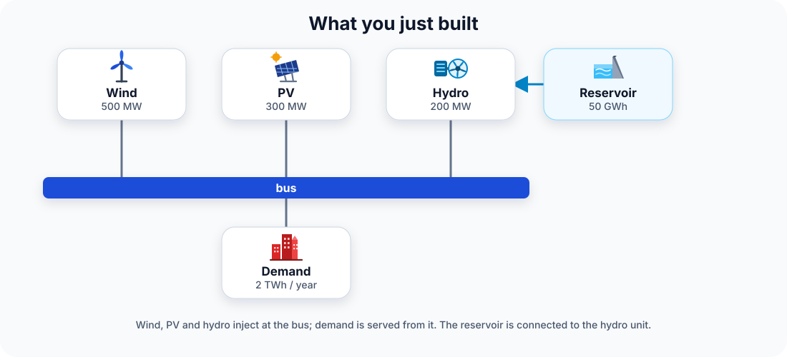

# Build your first model

Run a small electricity system with one bus, wind, PV, reservoir hydro and demand. The goal here is to understand the modelling pattern — not CESDM's internal architecture.

## 1. Run the example

From the **repository root**:

```bash
python docs/examples/minimal_electricity_model.py
```

You should see:

```text
Validated model and exported to output/minimal_electricity_model
  profiles: demand, wind CF, PV CF, hydro inflow (8760 h → profiles.h5)
```

The written model is in `output/minimal_electricity_model/demo_2030.yaml`; hourly series are in `profiles.h5`. A bus in that YAML looks like this:

```yaml
ElectricalBus:
  bus.demo:
    attributes:
      - {id: name, value: Demo bus}
    relations:
      - {id: belongsToCarrierDomain, target_entity_ids: [domain.electricity]}
      - {id: belongsToGeographicalRegion, target_entity_ids: [region.country.CH]}
```

That is the same object you create in Python. The rest of the file lists the plants, the demand and the profile metadata.

## 2. What you just built

{ width="88%" }

CESDM represents the physical objects explicitly:

| In the energy system | CESDM representation |
|---|---|
| Study | `EnergySystemModel` |
| Electrical node | `ElectricalBus` |
| Wind / PV plant | `GenerationUnit` |
| Reservoir hydro | `HydraulicStorageUnit` + `HydroGenerationUnit` |
| Load | `DemandUnit` |

Shared definitions such as “onshore wind” are referenced from a library instead of being redefined in every study.

## 3. The modelling pattern

The complete runnable script contains setup code for loading CESDM's vocabulary and shared libraries. For a first read, focus on the part that describes the physical system:

```python
bus = model.add_entity("ElectricalBus", "bus.demo")

wind = model.add_entity("GenerationUnit", "gen.demo.wind")
wind.nominal_power_capacity = (500, "MW")
wind.hasTechnology = GeneratorTypes.GENERATION_RENEWABLE_WIND_ONSHORE
wind.atNode = bus

pv = model.add_entity("GenerationUnit", "gen.demo.pv")
pv.nominal_power_capacity = (300, "MW")
pv.atNode = bus

hydro = model.add_entity("HydroGenerationUnit", "gen.demo.hydro")
hydro.nominal_power_capacity = (200, "MW")
hydro.atNode = bus

demand = model.add_entity("DemandUnit", "dem.demo")
demand.annual_energy_demand = (2_000_000, "MWh/year")
demand.atNode = bus
```

Read this as:

```text
create a bus
create wind / PV / hydro → give each a size → connect it to the bus
create demand            → give it an annual demand → connect it to the bus
```

The script also creates the reservoir and hourly profiles (demand, wind and PV availability, inflow).

!!! info "Where did `model` and the libraries come from?"
    The runnable script begins by loading the CESDM schema and standard libraries. That setup is deliberately not the focus of this first tutorial. [Build models](../use/build-models.md) explains the complete workflow; [Schemas](../understand/schemas.md) and [Libraries](../understand/libraries.md) explain what is being loaded.

## 4. Validate and export

The final steps check that the description is consistent and write it to files:

```python
errors = model.validate()
if errors:
    for error in errors:
        print(error)

model.export_yaml_hierarchical(
    "output/minimal_electricity_model/demo_2030.yaml"
)
```

You have now followed the basic CESDM loop:

```text
BUILD → CONNECT → CHECK → EXPORT
```

## Next

- **Do more with the model:** [Use CESDM](../use/index.md)
- **Understand the concepts you just used:** [Entities and relationships](../understand/entities-and-relationships.md)

A longer multi-country walkthrough is [Building a CESDM Model](../examples/building-first-model/overview.md) in Use CESDM when you need it.
