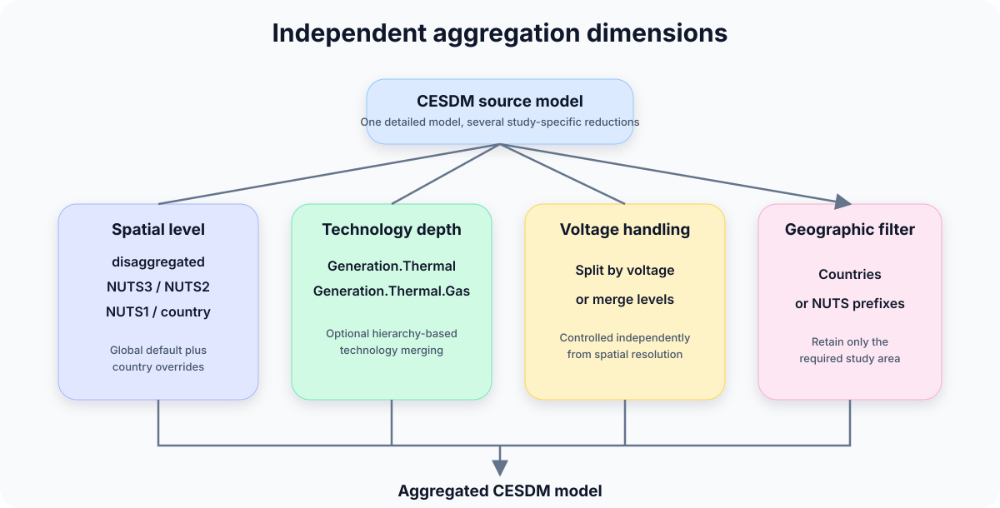
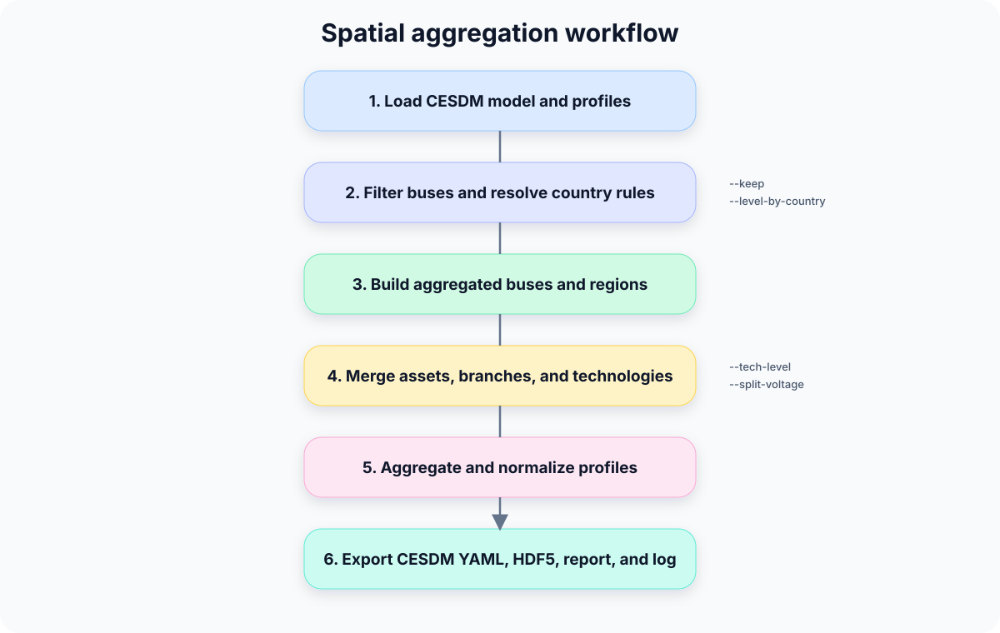
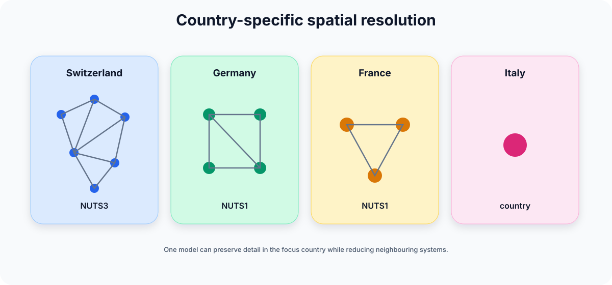

# Spatial Aggregation

!!! abstract "Before you start"
    - **Prerequisites:** A complete detailed CESDM model ([Building your CESDM Model](../tutorials/building-first-model/overview.md) or your own)
    - **You'll learn:** how to derive coarser models for studies that do not need nodal detail

!!! info "Reference model"
    Examples build upon [Building your CESDM Model](../tutorials/building-first-model/overview.md).

## Why Spatial Aggregation?

One of the key ideas behind CESDM is that a single detailed energy system model can support many different analyses.

**Modeller scenario:** You built a nodal TYNDP-style model, but your capacity expansion tool needs country-level regions. Spatial aggregation derives that coarser model without rebuilding from scratch.

However, not every analysis requires the same spatial resolution.

For example:

| Analysis | Typical Spatial Resolution |
|-----------|----------------------------|
| Dynamic Simulation | Original transmission network |
| AC Power Flow | Nodal transmission network |
| Security Analysis | Nodal or NUTS3 |
| Production Cost Modelling | NUTS2 or NUTS1 |
| Capacity Expansion Planning | Country |
| European Scenario Studies | Mixed country resolutions |

Rather than maintaining multiple independent models, CESDM derives smaller analysis-specific models from the common system model.

Spatial aggregation performs this transformation while preserving the CESDM structure.



---

## Aggregation Dimensions

Spatial aggregation combines four independent concepts.

| Dimension | Purpose |
|-----------|---------|
| Spatial Resolution | Merge buses geographically |
| Country-specific Resolution | Different aggregation level per country |
| Technology Aggregation | Merge similar technologies |
| Voltage-level Handling | Keep or merge voltage levels |

These dimensions can be combined freely.

---

## Configuring Aggregation

The global aggregation level is defined by:

```bash
--level nuts2
```

Supported levels are:

| Level | Description |
|---------|-------------|
| disaggregated | Original buses |
| nuts3 | Aggregate by NUTS3 |
| nuts2 | Aggregate by NUTS2 |
| nuts1 | Aggregate by NUTS1 |
| country | Aggregate by country |

The aggregation level can be overridden for individual countries.

```bash
--level country \
--level-by-country CH=nuts3 DE=nuts1 FR=nuts1
```

This creates hybrid models where Switzerland remains detailed while neighbouring countries are represented more coarsely.

---

## Geographic Filtering

Only selected countries or NUTS regions can be retained.

```bash
--keep CH DE FR
```

or

```bash
--keep CH fr042
```

Branches whose endpoints lie outside the selected region are removed automatically.

---

## Voltage Levels

Voltage levels can either be preserved

```bash
--split-voltage
```

or merged

```bash
--no-split-voltage
```

depending on the intended analysis.

---

## Technology Aggregation

Technology aggregation is independent from spatial aggregation.

Technology identifiers can be truncated at arbitrary hierarchy levels.

```text
Generation.Thermal.Gas.CCGT.New

↓

Generation.Thermal.Gas
```

using

```bash
--tech-level 3
```

or

```bash
--tech-level-by-country DE=3
```

This allows, for example, all gas technologies within Germany to be merged while preserving full technology detail elsewhere.

---

## How Aggregation Works

Spatial aggregation rebuilds a new CESDM model rather than modifying the existing one.

The workflow consists of:

1. Load the CESDM model.
2. Select the retained geographic region.
3. Determine the aggregation level for each country.
4. Create aggregated buses.
5. Reassign connected assets.
6. Aggregate generation, demand and storage.
7. Rebuild network topology.
8. Aggregate profiles.
9. Validate the resulting CESDM model.
10. Export the aggregated model.



---

## Asset-specific Aggregation

Different asset classes require different aggregation rules.

| Asset | Typical Aggregation |
|--------|---------------------|
| Demand | Sum demand, weighted demand profile |
| Generation | Sum capacities, weighted efficiencies and costs |
| Storage | Sum capacities, weighted efficiencies |
| Reservoirs | Preserve reservoir–generator relations |
| Transmission Lines | Merge parallel corridors |
| Interconnectors | Sum transfer capacities |
| Transformers | Merge by endpoint pair |

Time-series profiles are aggregated consistently and new CESDM Profile entities are generated automatically.

---

## Running Spatial Aggregation

A typical aggregation is executed as:

```bash
python tools/aggregate_cesdm_yaml_subset.py \
    --schemas schemas/cesdm \
    --yaml model.yaml \
    --h5 profiles.h5 \
    --outdir results \
    --level country \
    --level-by-country CH=nuts3 DE=nuts1 \
    --keep CH DE FR IT AT \
    --split-voltage
```

The tool produces:

```text
cesdm/

    yaml/

    profiles/

    frictionless/

aggregation_log.txt

subset_summary.txt
```

The output remains a valid CESDM model.

---

## Typical Workflows

## Country Planning

```bash
--level country
```

---

## Detailed Switzerland

```bash
--level country
--level-by-country CH=nuts3
```

---

## Structural Aggregation Only

```bash
--no-profiles
```

---

## Technology Reduction

```bash
--tech-level 3
```

---

## Design Principles

Spatial aggregation follows several important principles.

- The original CESDM model is never modified.
- A new CESDM model is generated.
- All semantic relations are preserved.
- Time-series remain semantically consistent.
- The result is again a valid CESDM model.
- Multiple aggregated models can be derived from the same source model.

---

## Limitations

Spatial aggregation is a model reduction technique.

Consequently,

- internal congestion disappears,
- internal branches are removed,
- electrical parameters become weighted approximations,
- results depend on the quality of the original model.

---

## Summary

Spatial aggregation derives smaller analysis-specific CESDM models from one common detailed system model.

Different combinations of

- spatial resolution,
- technology resolution,
- voltage handling,
- and geographic filtering

allow the same physical energy system to be represented at the level of detail required by each analysis while preserving a consistent CESDM representation.

---

## When not to use spatial aggregation

- Your study **requires nodal detail** (AC power flow, contingency analysis on specific lines).
- You need **internal congestion** within a region — aggregation removes it.
- The source model lacks geographic metadata needed for aggregation.



---

## Next step

→ [Modeller cheat sheet](../getting-started/modeller-cheat-sheet.md) · [← Modelling Workflow](modelling-workflow.md)
