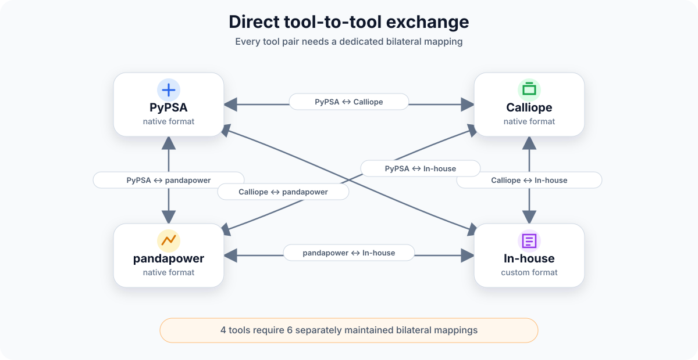
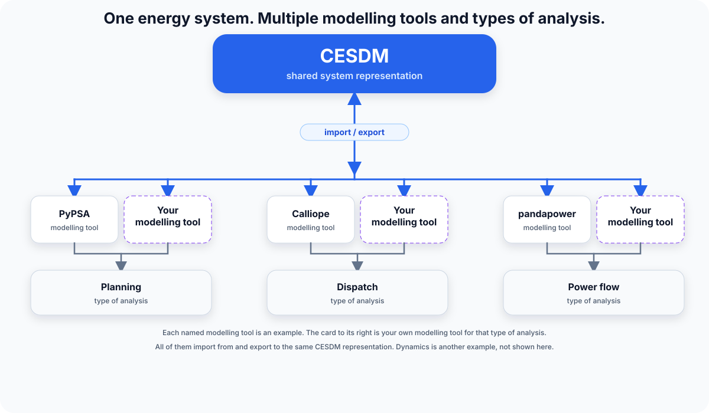

# CESDM

{ width="78%" }

**One energy system. Multiple tools and analyses.**

CESDM provides a shared, machine-readable representation of an energy system that can be reused across modelling tools (e.g. PyPSA, Calliope, pandapower) and types of analysis (e.g. planning, dispatch, power flow and dynamics).

> **CESDM provides the shared system representation, connecting modelling tools and enabling reuse across different types of analysis.**

!!! note "First release"
    This first release is a **starting point**: a usable, flexible framework for a shared energy-system representation. The aim is that modelling communities can develop that objective together — through new use cases, adapters, schema extensions and critique. Pin the toolbox commit or release and the schema version (**1.0.0**) when you share a model. [Roadmap](community/roadmap.md) · [Release log](community/changelog.md) · [Schema governance](develop/governance.md)

## CESDM in one picture

Without CESDM, every pair of modelling tools needs its own converter.

{ width="85%" }

CESDM is the **shared system representation**. Modelling tools **import** and **export** that representation and run different **types of analysis**.

{ width="88%" }

| CESDM is | CESDM is not |
|---|---|
| A shared system representation of energy-system assets, networks, relationships and associated data, with validation and import/export support | An optimiser, power-flow solver or replacement for the modelling tools that run the types of analysis |

## Start here

New to CESDM? Start with these three steps:

1. **Understand** — [What is CESDM?](get-started/what-is-cesdm.md)
2. **Install** — [Set up the toolbox](get-started/install.md)
3. **Build** — [Create your first model](get-started/first-model.md)

## I want to…

| I want to… | Go to |
|---|---|
| Build, validate and import/export models | [Use CESDM](use/index.md) |
| Convert TYNDP 2024 or PyPSA `elec.nc` | [Convert TYNDP and PyPSA](examples/import-tyndp-and-pypsa.md) |
| Connect CESDM to my own or another modelling tool | [Adapter development](develop/adapter-development.md) |
| Understand how CESDM represents an energy system | [Understand CESDM](understand/index.md) |
| See why CESDM exists beside CIM/CGMES, ESDL, oemof and neighbouring formats | [Related work](understand/related-work.md) |
| Walk through a larger worked example | [Building a CESDM Model](examples/building-first-model/overview.md) |
| Look up a class, attribute or relation | [Glossary](reference/glossary.md) · [Schema reference](reference/schema.md) |
| Extend CESDM or the schemas | [Develop CESDM](develop/index.md) |
| What is stable, experimental, or next | [Roadmap](community/roadmap.md) |
| FAQ, citation or contributing | [Community](community/faq.md) |
