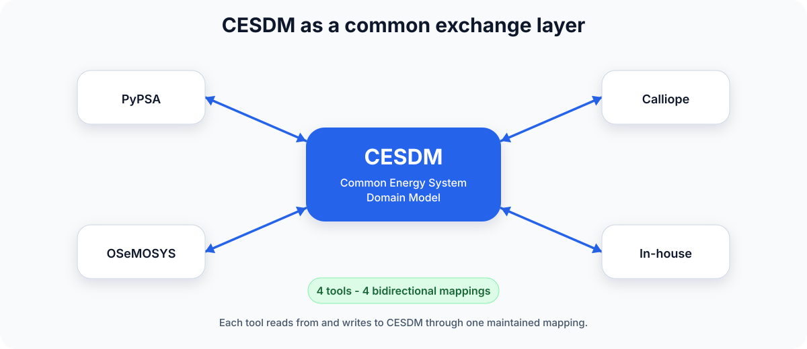
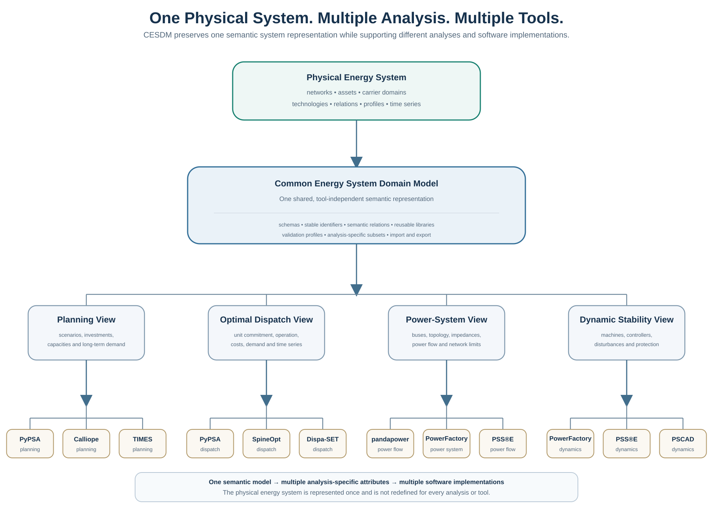

# Common Energy System Domain Model (CESDM)

{ width="78%" }

  
  
  
  

!!! quote ""
    **What is CESDM?** A common description of an energy system that different modelling tools can share.

    **Why use it?** One system description — shared data, comparable results.

[CESDM in 5 Minutes](getting-started/cesdm-in-5-minutes.md){ .md-button .md-button--primary }
[Build a Small Electricity System](getting-started/first-model-simple.md){ .md-button }
[Look up a class](reference/schema-reference.html){ .md-button }

---

## Start here

| I want to… | Go to |
|------------|--------|
| Understand CESDM in five minutes | [CESDM in 5 Minutes](getting-started/cesdm-in-5-minutes.md) |
| Install and run a first model | [Quickstart](getting-started/quickstart.md) |
| Build wind + PV + hydro + demand | [Build a Small Electricity System](getting-started/first-model-simple.md) |
| Import an existing PyPSA / pandapower model | [Tool adapters](guides/tool-adapters.md) |
| Look up an entity or attribute | [Schema Reference](reference/schema-reference.html) |

[Choose your path →](getting-started/choose-your-path.md)

---

## CESDM is — and is not

| CESDM is | CESDM is not |
|----------|--------------|
| A common energy-system description | An optimisation model |
| A semantic data model + validation | A power-flow solver |
| An interoperability layer | Another PyPSA |
| A place to store inputs and compare results | A scenario database or CIM for operations |

CESDM **describes the system**. Tools **perform analyses** on it.

[Project status](getting-started/project-status.md) · [CESDM vs other tools](getting-started/cesdm-vs-others.md)

---

## Why CESDM?

**Problem:** Different teams describe the **same system** in different software. To exchange that system they need a converter for **every pair of tools**.

**Motivation:** CESDM is the shared description in the middle. Each tool connects **once**.

{ width="85%" }

- :material-database:{ .lg .middle } __Single source of truth__

    ---

    One topology, one set of assets — not a separate export from every tool.

- :material-chart-multiple:{ .lg .middle } __Multi-analysis__

    ---

    Dispatch, grid analysis, and stability on the **same equipment**.

- :material-swap-horizontal:{ .lg .middle } __Multi-tool__

    ---

    Each analysis program maps once to the shared model.

{ width="88%" }

[Full introduction →](getting-started/what-is-cesdm.md)

---

## What you can do

- :material-transmission-tower:{ .lg .middle } __Build a small system__

    ---

    One bus, wind, PV, hydro, demand — validate and export

    [Tutorial →](getting-started/first-model-simple.md)

- :material-check-circle:{ .lg .middle } __Validate before hand-off__

    ---

    Catch missing capacities, bad units, or incomplete study data

    [Validation →](getting-started/validation.md)

- :material-export:{ .lg .middle } __Exchange models__

    ---

    YAML, JSON, CSV, Excel, Frictionless — HDF5 for time series

    [Workflow →](guides/modelling-workflow.md)

- :material-book-search:{ .lg .middle } __Look up classes__

    ---

    Interactive catalogue of entities, attributes, and relations

    [Schema Reference →](reference/schema-reference.html)

---

## Documentation

| Section | Goal |
|---------|------|
| **Learn** | What CESDM is, vs other tools, how it represents a system |
| **Build** | First system, full reference model, conversion units |
| **Use** | Profiles, libraries, tool adapters |
| **Look up** | Schema, cheat sheet, glossary |
| **Develop** | Python APIs and schema extensions |

[Documentation map →](getting-started/choose-your-path.md#documentation-map)

---

## Open source

[SWEET-CoSi](https://sweet-cosi.ch) · [Contributing](community/contributing.md) · [Citation](community/citation.md) · [Disclaimer](getting-started/disclaimer.md)
